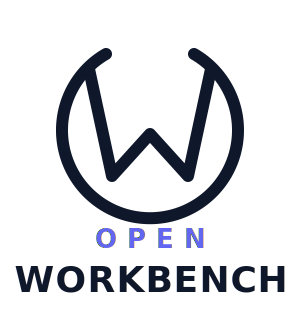

  

<h3 align="center">De-Cloud. De-SaaS. Empower Digital Independence.</h3>

  A community-driven open-source initiative building practical, production-ready infrastructure and applications so organizations can own and operate their critical technology — without unnecessary dependence on external cloud providers or proprietary SaaS platforms.

 

## Our Mission

We believe organizations should have the freedom to choose where their technology runs, how their data is managed, and who controls their digital future.

Every OpenWorkBench project addresses a specific business problem while contributing to a larger mission: enabling organizations to confidently run critical workloads on infrastructure they control.

## Principles

- **Digital sovereignty over digital dependency**
- **Open standards over vendor lock-in**
- **Self-hosting where it makes sense**
- **Transparent, community-driven development**
- **Enterprise-ready open-source software**
- **Privacy, security, and long-term sustainability by design**

---

## Projects

### Identity & Security
| Project | Description |
|---------|-------------|
| [IdentityCore](https://github.com/OpenWorkBench-Co/IdentityCore) | Sovereign identity — authentication, SSO, OAuth, secrets, and access management |
| [OpenWAF](https://github.com/OpenWorkBench-Co/OpenWAF) | Sovereign web application firewall for AI-native applications |
| [OpenFirewall](https://github.com/OpenWorkBench-Co/OpenFirewall) | Sovereign network firewall — intelligent protection for modern infrastructure |

### Networking & Routing
| Project | Description |
|---------|-------------|
| [OpenSDN](https://github.com/OpenWorkBench-Co/OpenSDN) | Sovereign software-defined networking — DNS, proxy, routing, and service mesh |
| [OpenRegistry](https://github.com/OpenWorkBench-Co/OpenRegistry) | Self-hosted container and artifact registry for sovereign infrastructure |

### Storage & Data
| Project | Description |
|---------|-------------|
| [OpenDisk](https://github.com/OpenWorkBench-Co/OpenDisk) | Sovereign enterprise object storage — intelligent, scalable, and open |
| [OpenGit](https://github.com/OpenWorkBench-Co/OpenGit) | Self-hosted Git for sovereign teams — secure source control and collaboration |

### Observability
| Project | Description |
|---------|-------------|
| [OpenMonitor](https://github.com/OpenWorkBench-Co/OpenMonitor) | Sovereign observability — metrics, alerting, dashboards, and event queuing |
| [OpenLogger](https://github.com/OpenWorkBench-Co/OpenLogger) | Sovereign structured logging for apps, infrastructure, and AI agents |

### Developer Tools
| Project | Description |
|---------|-------------|
| [OpenLinter](https://github.com/OpenWorkBench-Co/OpenLinter) | Sovereign linter for AI-native apps, agents, and modern code |
| [OpenSpecKit](https://github.com/OpenWorkBench-Co/OpenSpecKit) | Unified API specification toolkit for the sovereign Open stack |
| [OpenPattern](https://github.com/OpenWorkBench-Co/OpenPattern) | Sovereign design patterns for AI and software systems |

### AI & Automation
| Project | Description |
|---------|-------------|
| [OpenInference](https://github.com/OpenWorkBench-Co/OpenInference) | Sovereign LLM inference — open, modular, and self-hostable |
| [OpenPipeline](https://github.com/OpenWorkBench-Co/OpenPipeline) | Sovereign workflow orchestration for AI and application pipelines |

### End-User Applications
| Project | Description |
|---------|-------------|
| [OpenEditor](https://github.com/OpenWorkBench-Co/OpenEditor) | Sovereign document editor — files, PDFs, spreadsheets, and presentations |
| [OpenMailer](https://github.com/OpenWorkBench-Co/OpenMailer) | Sovereign mail platform for humans and AI agents — secure and programmable |
| [OpenTerminal](https://github.com/OpenWorkBench-Co/OpenTerminal) | Sovereign terminal for humans and AI agents — secure and collaborative |
| [OpenBrowser](https://github.com/OpenWorkBench-Co/OpenBrowser) | Sovereign AI-native browser — secure, private, and built for enterprise work |

---

  <em>Open by Design. Sovereign by Choice.</em>

